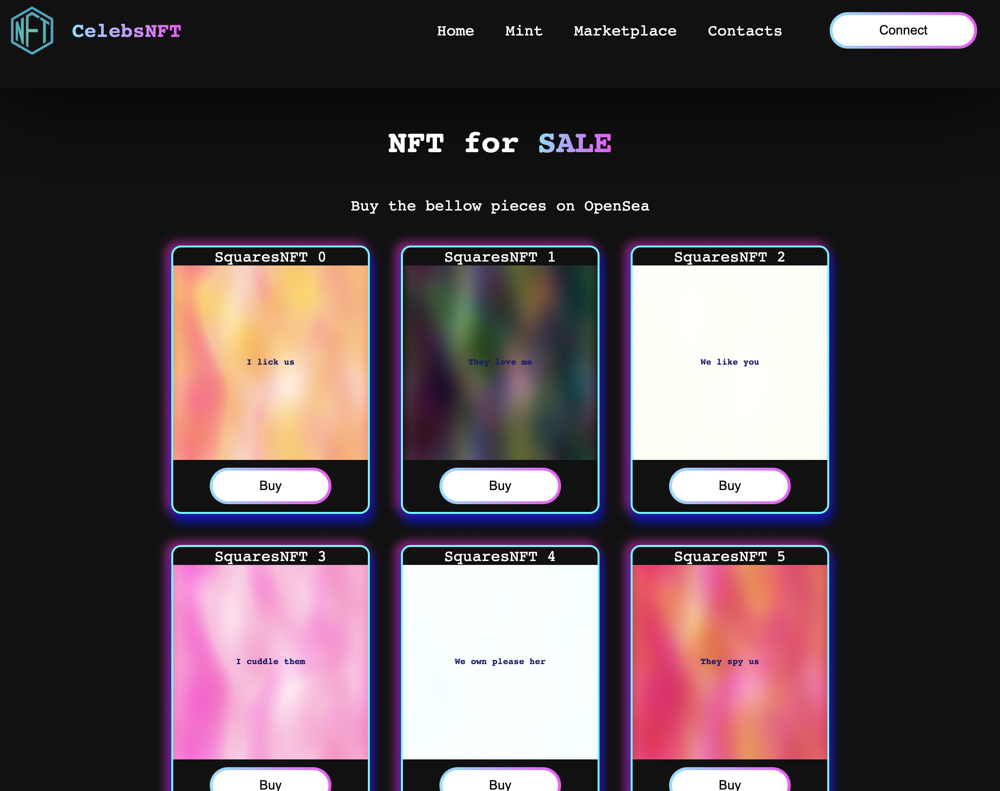

# Celebs NFT 2023 collection

Click to see:<a href="https://celebs-nft-2023-collection-4l57.vercel.app/">NFT Squares Collection 2023</a>

### To create png or jpeg NFT stored on thirdparty servers

=== Starting deploy ===

celebsNFT contract deployed to address:  0xc81a4214F1Fc12E1616128C64F7E2f87A54D75C2

 tokenURI will be JSON string hosted on web 

Check on OpenSea: <a href="https://testnets.opensea.io/assets/goerli/0xc81a4214f1fc12e1616128c64f7e2f87a54d75c2/0">HERE</a> 

Store JSON - https://www.jsonkeeper.com/

Host img - https://imgur.com/

Convert img - https://animefilter.com/

JSON example for Kim: (https://jsonkeeper.com/b/3I5A) 
{"name":"Kim Kardashian","description":"Kimberly Noel Kardashian is an American socialite, media personality, and businesswoman.","image":"https://i.imgur.com/qX0K3Qi.png","attributes":[{"trait_type":"Born","value":"21 October 1980"},{"trait_type":"Gender","value":"Female"},{"trait_type":"Height","value":"1.57m"}]}

### To create svg NFT stored on the blockchain

=== Starting deploy ===

celebsNFT contract deployed to address:  0x919bE4c3Be64fE850E758caa893bC8CBb52E0982

 tokenURI will be app JSON string for abi.encodePacked 

base64 encode - https://www.utilities-online.info/base64?utm_source=buildspace.so&utm_medium=buildspace_project

 test svg string - data:image/svg+xml;base64,INSERT_YOUR_BASE64_ENCODED_SVG_HERE

 test app JSON string - data:application/json;base64,

 svg preview - https://www.svgviewer.dev/?utm_source=buildspace.so&utm_medium=buildspace_project 

Check on OpenSea: <a href="https://testnets.opensea.io/assets/goerli/0x919bE4c3Be64fE850E758caa893bC8CBb52E0982/0">HERE</a> 

